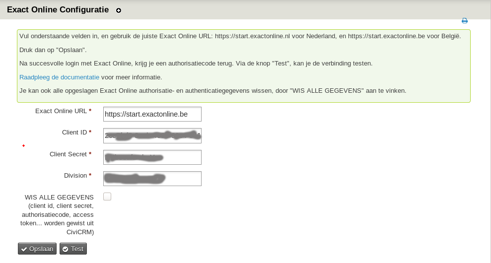
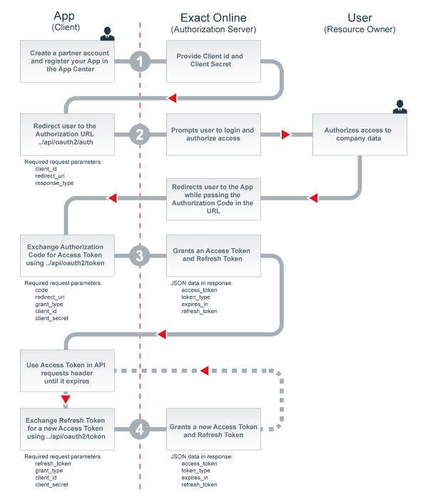

# eu.businessandcode.exactonline

Deze extensie is een hulpmiddel om gegevens te synchroniseren tussen CiviCRM en Exact Online.

## Wat doet deze extensie?

Deze extensie doet in essentie 2 dingen:

 * het handelt de authorisatie en authenticatie af die nodig is om met Exact Online te communiceren: client ID, client secret, refresh tokens...
 * het biedt PHP classes aan om te interageren met Exact Online. Dit gebeurt via een stabiele versie van de Exact Online PHP client, ontwikkeld door Picquer.
Zie https://github.com/picqer/exact-php-client
 

## Wat doet deze extensie niet?

De aanmaak of synchronisatie van klanten, leveranciers, verkoopfacturen, kostenplaatsen... moet je zelf programmeren in een aparte extensie. Dat is immers klantspecifiek.  

## Voorbereiding in Exact Online

Om gegevens te kunnen uitwisselen tussen jouw Exact Online dossier en CiviCRM moet je over een zogenaamde "client id" en "client secret" beschikken.

Meld je aan in Exact Online, en bovenaan in de blauwe balk klik je rechts op Partners > App center

Een nieuw venster wordt geopend.

Klik vervolgens op "Registreer API-sleutels" (rode balk)

Klik dan op "+ Een API sleutel registreren". In het veld URL vul je de link naar je website in (bv. https://mijnwebsite.com).

## Voorbereiding in CiviCRM

Surf naar _https://WEBSITE_/civicrm/exactonline/settings en vul de nodige gegegens in:

  * Exact Online URL (.nl of .be)
  * Client ID
  * Client secret
  * Division (dit is het nummer van je administratie)

Klik dan op opslaan. Je zal moeten aanmelden in Exact Online

## Achtergrondinformatie

### Authorisatieprocedure

Met je client id en client secret, zal CiviCRM je doorverbinden met https://start.exactonline.nl (voor Nederland) of https://start.exactonline.be (voor België).
Door aan te melden met je gebruikersnaam en wachtwoord, krijgt CiviCRM een authorisatiecode terug. Deze blijft 1 jaar geldig.

### Access token

Om vanuit CiviCRM dingen te doen in Exact Online (bv. een verkoopfactuur aanmaken, de gegevens van een contact synchroniseren...), hebben we eerst een access token nodig.

Die wordt aangevraagd via /api/oauth2/auth, en je client id, client secret en authorisatiecode.

Naast een access token, krijgen we ook een vervaldatum terug en een refresh token.

Voor elke aanroep van de API geven we de access token mee.

Wanneer de access token vervalen is (= na 10 minuten), wordt een nieuw aangevraagd aan de hand van de refresh token.
Dit gebeurt automatisch door /api/oauth2/token aan te roepen, met je client id, client secret en refresh code.

### Schematische voorstelling  

